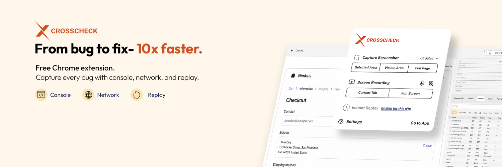

  

[**Install free →**](https://chromewebstore.google.com/detail/crosscheck/acnahejlmejjbbloeodkkpapmbnieljf) · [Website](https://crosscheck.cloud) · [Docs](https://crosscheck.cloud/docs) · [Changelog](https://crosscheck.cloud/changelog)

---

## What we build

Crosscheck makes bug reports actually useful. Instead of *"the button doesn't work,"* your team gets a shareable link with the screenshot, the user's last 2–5 minutes of actions, the console errors, the failed network requests, and the performance metrics — all captured automatically.

Built for front-end developers, QA engineers, product managers, and anyone who reports or fixes software bugs.

## Why teams choose Crosscheck

- **One-click capture** — a single hotkey grabs everything devs need to fix a bug.
- **Instant Replay** — watch the last 2–5 minutes of what the user did, powered by rrweb.
- **AI-native** — Model Context Protocol (MCP) integration with Claude, Cursor, and ChatGPT.
- **Zero friction** — free, no signup wall, runs entirely in the browser.
- **Works with your stack** — Jira, ClickUp, Slack, GitHub, Linear, Notion.

## Get involved

| | |
|---|---|
| **Try Crosscheck** | [Install from the Chrome Web Store](https://chromewebstore.google.com/detail/crosscheck/acnahejlmejjbbloeodkkpapmbnieljf) |
| **Read the docs** | [crosscheck.cloud/docs](https://crosscheck.cloud/docs) |
| **MCP server** | [mcp.crosscheck.cloud](https://mcp.crosscheck.cloud) |
| **Compare** | [vs Jam](https://crosscheck.cloud/compare/jam) · [vs Loom](https://crosscheck.cloud/compare/loom) · [vs Marker.io](https://crosscheck.cloud/compare/marker-io) · [vs BugHerd](https://crosscheck.cloud/compare/bugherd) · [vs Userback](https://crosscheck.cloud/compare/userback) |
| **Contact** | [info@crosscheck.cloud](mailto:info@crosscheck.cloud) |
| **Support** | [support@crosscheck.cloud](mailto:support@crosscheck.cloud) |
| **Security** | See [SECURITY.md](../SECURITY.md) |

## Follow along

We ship in public — releases, behind-the-scenes, and the occasional bug horror story.

- **X / Twitter:** [@CrosscheckCloud](https://x.com/CrosscheckCloud)
- **LinkedIn:** [linkedin.com/company/crosscheck-cloud](https://www.linkedin.com/company/crosscheck-cloud)
- **Facebook:** [facebook.com/crosscheck.cloud](https://www.facebook.com/crosscheck.cloud)
- **Instagram:** [@crosscheck.cloud](https://www.instagram.com/crosscheck.cloud)
- **Threads:** [@crosscheck.cloud](https://www.threads.com/@crosscheck.cloud)
- **TikTok:** [@crosscheck.cloud](https://www.tiktok.com/@crosscheck.cloud)
- **YouTube:** [@Crosscheck-Cloud](https://www.youtube.com/@Crosscheck-Cloud)
- **Discord:** [discord.gg/3rzDAy8X](https://discord.gg/3rzDAy8X)

---

Made with care by the Crosscheck team.

